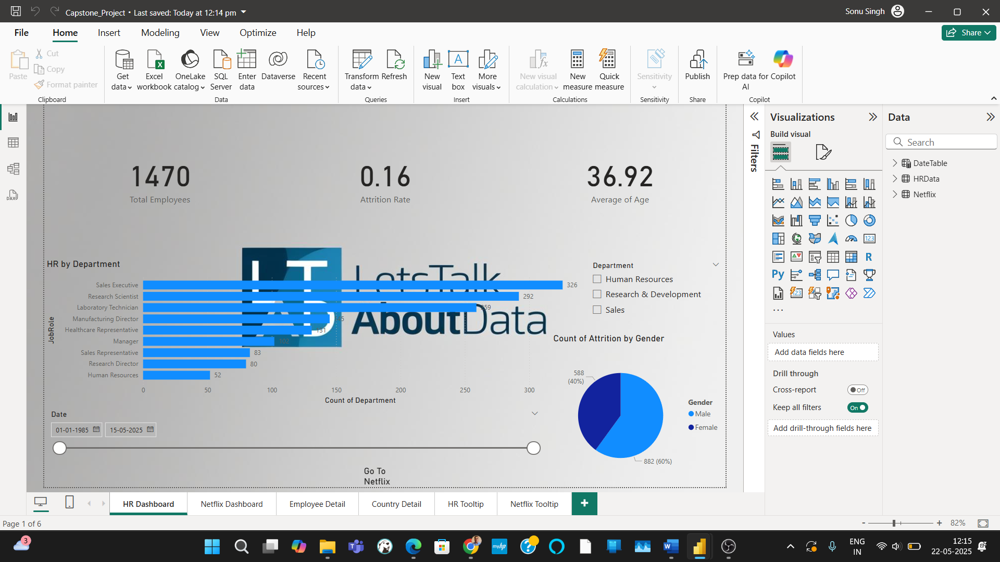
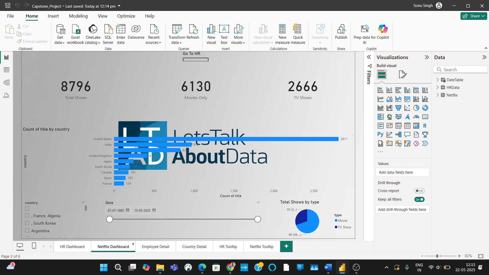

# HR + Netflix Capstone Dashboard (Power BI)

## 📊 Project Overview
This Power BI dashboard combines HR and Netflix datasets to demonstrate skills in data modeling, DAX, interactive visuals, and custom tooltips.

## 🔧 Features
- Interactive navigation buttons between HR and Netflix pages
- Drillthrough for Employee and Genre insights
- Custom tooltips using mini pages
- Sync slicers across both pages

## 📁 Files
- `Capstone_Project.pbix`: Final dashboard
- `Data/`: Raw Excel & CSV data
- `Screenshots/`: Sample visuals

## 📷 Preview

## 🚀 How to Use
1. Download the `.pbix` file
2. Open with Power BI Desktop
3. Explore interactivity and visuals

## 💡 Learnings
- Modeling multiple datasets in Power BI
- Drillthrough design
- Custom themes and layout best practices

## 🔗 Connect with Me
[LinkedIn](https://linkedin.com/in/sonutheanalyst) | [YouTube](https://youtube.com/@LetsTalkAboutData-LTAD)
